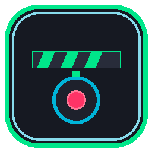

# StreamClipMarker 🎬⏱️

An ultra-lightweight Windows desktop utility for livestream clip timestamp marking, designed specifically for streamers using **TikTok LIVE Studio**, **OBS Studio**, and **Windows Screen Recording**.



[](https://github.com/AminSassi/StreamClipMarker/releases/latest)
[](https://github.com/AminSassi/StreamClipMarker/releases/download/v1.3.0/StreamClipMarker.exe)
[](https://github.com/AminSassi/StreamClipMarker/actions)
[](LICENSE)

> 🚀 **[Click here to download StreamClipMarker.exe (v1.3.0)](https://github.com/AminSassi/StreamClipMarker/releases/download/v1.3.0/StreamClipMarker.exe)** — Standalone Windows binary (~103 KB), no installation or runtimes required!

---

## The Problem & The Solution

- **The Problem:** TikTok LIVE Studio and other streaming apps automatically save your entire livestream recording to your PC after the stream ends, but don't have an instant clipping replay buffer. Using NVIDIA Instant Replay or OBS replay buffers often fails to capture your live overlays and eats valuable GPU, CPU, and RAM while gaming.
- **The Solution:** You already have the full livestream recording being saved! You don't need a second video recorder. **StreamClipMarker** is a **pure bookmarking/reference point system**, not a video editor. It runs quietly in your taskbar, auto-detects when your stream starts and stops, and records the exact elapsed timestamps whenever you press a global hotkey (**`F8`**). Later, you open the full recording in **Adobe Premiere Pro**, navigate directly to the bookmarked timestamps, review the surrounding footage, and manually decide exact cut boundaries. No video processing, no FFmpeg, and no artificial clip padding!

---

## ⚡ What Makes It Ultra-Lightweight (0.0% CPU & ~20–45 MB RAM)

1. **No Video or Screen Capture:** The application never touches video frames, doesn't capture the screen, and doesn't encode video.
2. **Zero Polling Hotkeys:** Hotkeys are registered directly with the Windows OS via the native Win32 `RegisterHotKey` API (`WM_HOTKEY`). The application sleeps until Windows notifies it of a keypress.
3. **Zero-Overhead File Watcher:** Auto-detection uses OS kernel I/O completion ports (`FileSystemWatcher`), which consumes 0.0% CPU while waiting for recording files to appear.
4. **1 Hz UI Timer:** The visual stopwatch ticks only once every 1,000 milliseconds (1 Hz).
5. **Native Windows Executable:** Built with native .NET Framework 4.8 WinForms. There is **no Electron, no Chromium, and no heavy runtime**. The entire standalone executable is just **~103 KB** (including embedded multi-resolution icons).

---

## 🔄 Robust 5-State Recording Detection

The application uses a 5-state recording machine to ensure **exactly one session per recording** without duplicate firing:

- **`○ WAITING FOR RECORDING`**: Active and listening for your stream or screen recorder to begin.
- **`● RECORDING DETECTED`**: A video container (`.mp4`, `.mkv`, `.flv`, `.ts`, `.mov`) has been created/locked, or TikTok LIVE Studio / OBS has gone live. The detected filename is displayed in the UI (e.g. `File: TikTok_Live.mp4`).
- **`◐ FINALIZING SESSION`**: The recorder has finished writing and released its file lock (or the process stopped). Session is being flushed.
- **`✓ SESSION SAVED`**: The session has been exported to TXT, JSON, and CSV in your Documents folder. Returns to waiting for the next recording after 2 seconds.
- **`○ IDLE`**: Standby mode when auto-detection is disabled.

### State & Debounce Highlights
- **Duplicate Event Debouncing:** Multiple rapid `Created` or `Changed` events from initial video container headers are debounced within a 3-second window.
- **Temporary File Handling:** Recorders writing to `.part` or `.tmp` before renaming to `.mp4` are properly tracked upon completion.
- **Reliable Stop Condition:** Requires confirmed file lock release across consecutive polling intervals with stable file size, preventing premature finalization during momentary buffer flushes.
- **Immediate Recorder Restarts:** Starting another recording immediately cleanly finalizes the previous session before opening a new one.

---

## 🔍 Test Recording Detection Mode

Want to verify detection before a real livestream?
1. Open **Settings** (`⚙ Settings`).
2. Click **`🔍 Test Recording Detection Diagnostics...`**.
3. A real-time diagnostic log window appears showing:
   - File creation, change, and rename events.
   - Detected filenames and timestamps.
   - Lock/unlock write status.
   - Exact state machine transitions.
   - A **Simulate Recording Event** button to test the watcher without opening streaming software.

---

## 🛡️ 3-Choice Session Recovery (Never Lose Clips)

Every marker is **immediately written to disk** (`current_session.json`) the moment F8 is pressed. If the PC crashes, power cuts out, or Windows restarts mid-stream:
- Upon launching StreamClipMarker again, a dedicated recovery dialog opens:
  - **`[ RESUME ]`**: Loads previous markers, starts stopwatch with prior elapsed duration, and resumes live recording session seamlessly.
  - **`[ FINALIZE ]`**: Immediately exports TXT, JSON, and CSV files for the recovered session and cleans up.
  - **`[ DELETE ]`**: Confirms and discards the unfinished session.

---

## ⌨️ Dual Hotkeys: Instant F8 + Ctrl+F8 Mark & Label

- **`F8` (Instant Mark):** Completely instantaneous, non-blocking, zero focus stealing. Press F8 in any fullscreen game and keep playing.
- **`Ctrl+F8` (Mark + Label):** Records the timestamp instantaneously first (so accuracy is never compromised), then opens a quick dialog to enter a note/label (e.g. "1v4 clutch" or "funny glitch").
- **Edit Afterward:** Double-click or right-click any marker in the list to edit its note at any time.

---

## 🔕 Silent Taskbar / System Tray Minimization

- Clicking the **red [X] close button** minimizes StreamClipMarker quietly into the Windows taskbar notification area (System Tray on the bottom right).
- The global hotkeys (`F8`, `Ctrl+F8`) and auto-detector continue listening silently in the background while you game.
- **Dynamic Tray Tooltip:** Hovering over the tray icon displays live status:
  ```
  StreamClipMarker
  Rec: ACTIVE | Markers: 4
  Last: 00:27:18
  ```
- **Right-click the tray icon** at any time to:
  - 🖥️ **Open StreamClipMarker** (or double-click the icon)
  - ⏱️ **Start / End Session**
  - 🎬 **Mark Bookmark (F8)**
  - ⚙️ **Settings**
  - ❌ **Exit Application** (safely saves any running session and closes the app completely)

---

## 📋 Bookmark Exports (CSV, TXT, JSON)

Saved automatically to `Documents\StreamClipMarker\TikTok_Stream_YYYY-MM-DD_HH-mm-ss.*` (and `clips.csv`):

### 1. CSV (`clips.csv` & session CSV)
```csv
Marker,Timestamp,Seconds
1,00:12:43,763
2,00:27:18,1638
3,00:41:06,2466
4,01:04:51,3891
5,01:37:22,5842
```
*(If custom labels are entered via `Ctrl+F8`, a `Note` column is included automatically: `Marker,Timestamp,Seconds,Note`)*.

### 2. Human-Readable (`.txt`)
```text
TikTok LIVE STREAM CLIP MARKERS
================================

Session:
2026-09-14 19:32:14

Duration:
02:13:42

Markers:

01. 00:12:43
02. 00:27:18
03. 00:41:06
04. 01:04:51
05. 01:37:22
```

### 3. Machine-Readable (`.json`)
```json
{
  "session_start": "2026-09-14T19:32:14",
  "duration": "02:13:42",
  "markers": [
    {
      "timestamp": "00:12:43",
      "seconds": 763
    },
    {
      "timestamp": "00:27:18",
      "seconds": 1638
    },
    {
      "timestamp": "00:41:06",
      "seconds": 2466
    }
  ]
}
```

---

## ⏱️ Recording Time Offset

- **Adjust Reference Timestamp:** The marker session and the video recording file may not begin at the exact same millisecond. The offset feature simply adjusts the bookmark reference time.
  - Example: You press F8 at `01:23:47`. If your recording started 3 seconds before the session timer, setting recording offset to `+3s` adjusts the reference bookmark to `01:23:50`!
  - Quick `[-]` and `[+]` adjustment buttons live directly on the main window.
  - Negative offsets clamp safely at `00:00:00`.
- **Zero Video Cutting Assumptions:** StreamClipMarker answers only *"Where in my livestream did I bookmark this moment?"* You make all clipping and boundary decisions manually in Adobe Premiere Pro after reviewing the surrounding footage.

---

## 🧪 Automated Test Suite

Run all automated unit test suites with Python:
```powershell
python tests/test_clip_logic.py
python tests/test_auto_detector.py
python tests/test_state_machine.py
python tests/test_csv_export.py
python tests/test_session_recovery.py
```
*(All 24 unit tests pass in <0.05s)*

---

## 🔨 Building from Source

To recompile `StreamClipMarker.exe`:
Double-click `build.bat` or run:
```powershell
.\build.ps1
```
Uses the built-in Windows .NET Framework compiler (`csc.exe`). No external SDKs needed.
